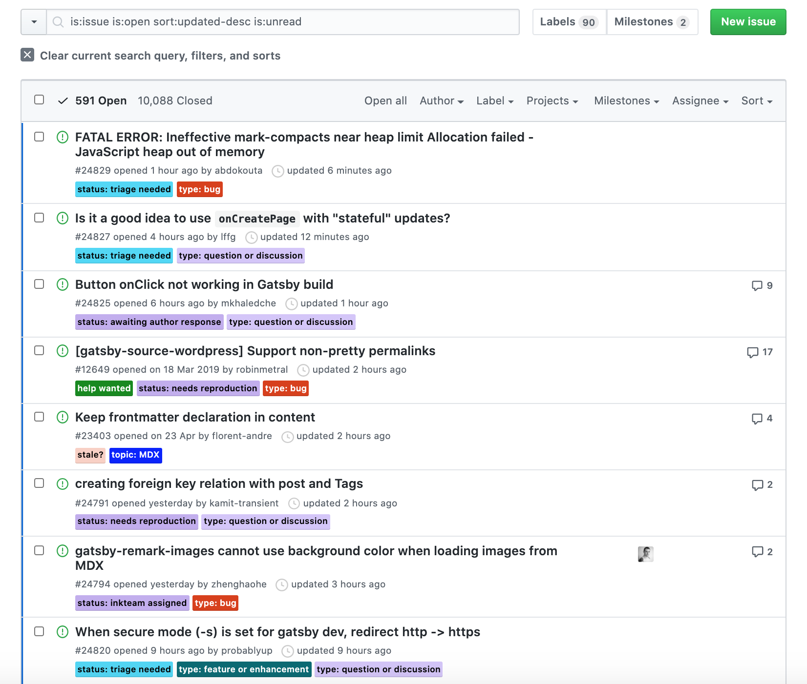
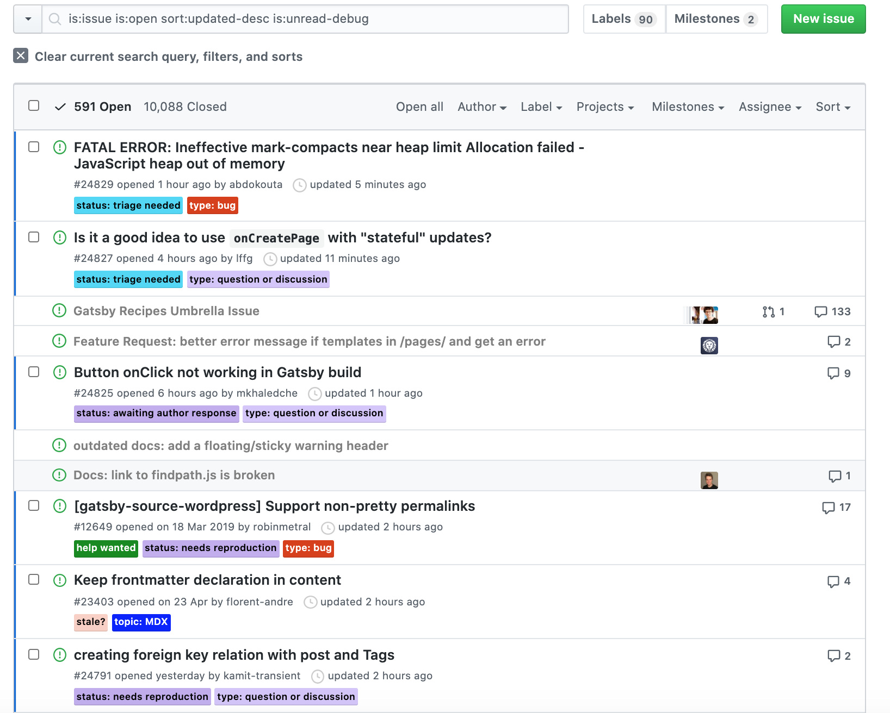
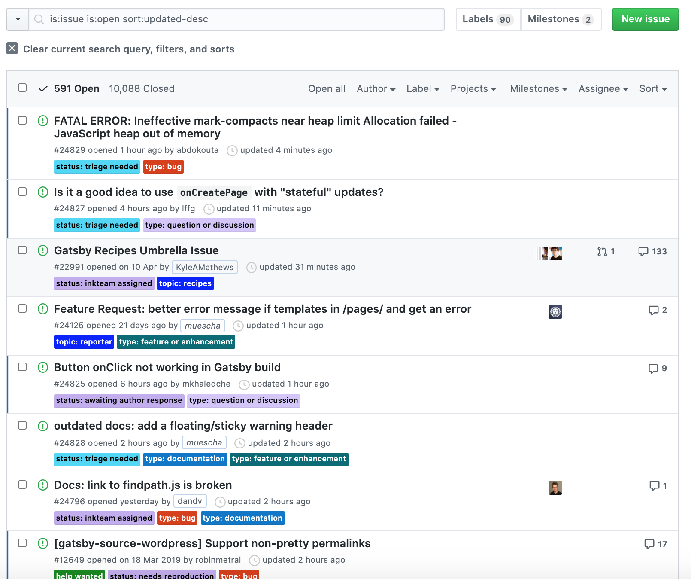

# GitHub Userscripts

Userscripts to add functionality to GitHub

## Hide Unread Issues

Hides unread issues and pull requests. Type it as additional parameter into to the search box.

### Usage:

- `is:unread` hide unread messages
- `is:unread-debug` grey the unread messages

### Installation

- [install](https://raw.githubusercontent.com/muescha/GitHub-userscripts/master/github-unread.user.js)

### Screenshots

#### `is:unread`

#### `is:unread-debug`

#### normal

